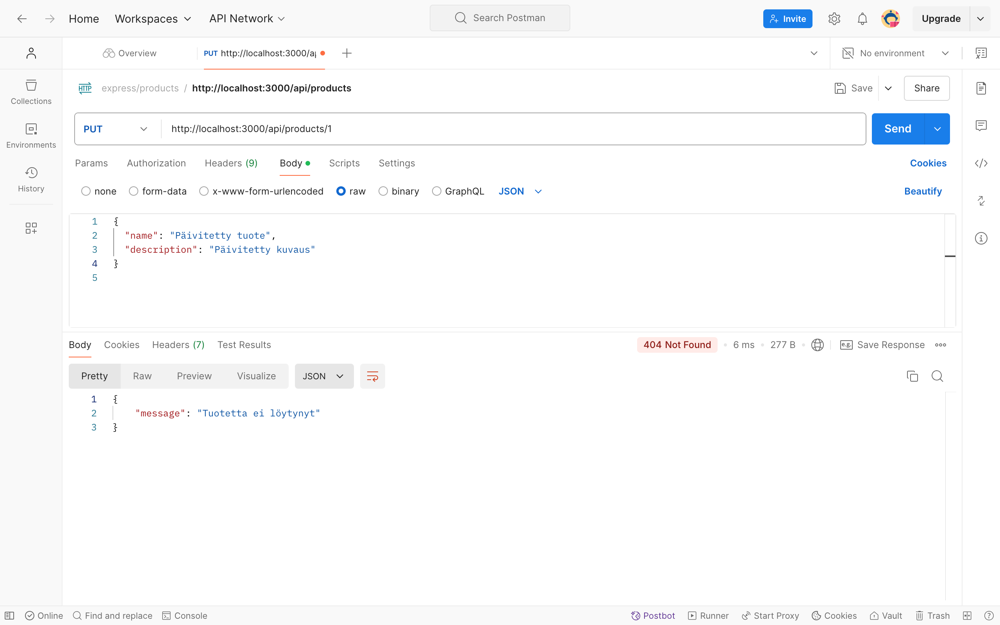

# Node.js & Express REST API

Tämä projekti on Node.js- ja Express-pohjainen REST API, joka tarjoaa yksinkertaisen sovellusliittymän tuotteiden hallintaan. Lisäksi se käyttää Pug-mallimoottoria renderöimään yksinkertaisen HTML-aloitussivun.

## Asennusohjeet

1. **Kloonaa** tämä repositorio:

   ```bash
   git clone <git@github.com:BerIdr/node-rest-api.git>
   cd <idrizberisha@Idrizs-MacBook-Pro node-rest-api>

   ### Testitulokset
   ```

- **GET /api/products**: 
- **POST /api/products**: 
- **DELETE /api/products/:id**: 
- **PUT /api/products/:id**: 
